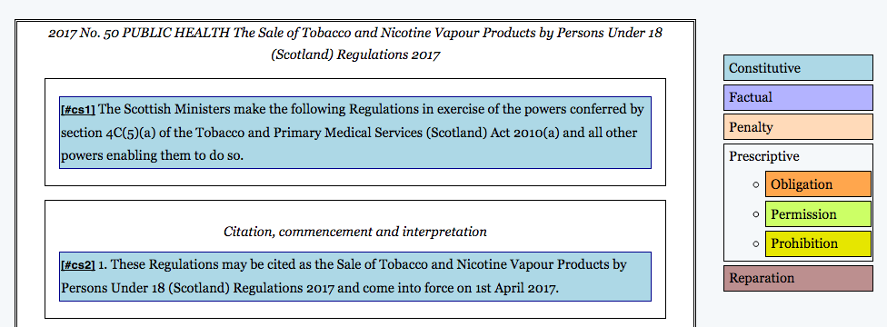
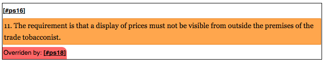
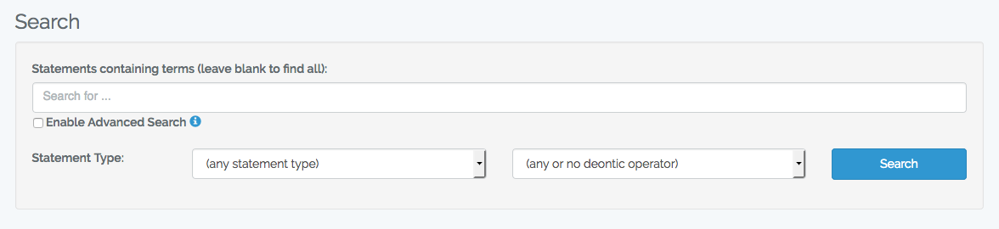
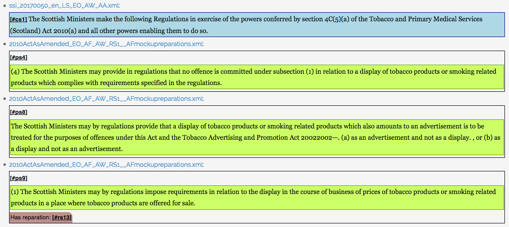

# User’s guide

From the home page, a logged-out user can see the tabs **Documents**, **Search**, and the option to **Log in**. A logged-in user can see **Documents**, **Search**, **Upload documents** and **Create account**.

## Documents
This tab presents a list of documents that have been uploaded. The name of a document can be clicked to navigate to its page.

From a document’s page, all users have the option to click **Download** to download the document in its original LegalRuleML XML format. Logged-in users can also click **Delete** to delete the document.

Within the double black border is the visualisation of the LegalRuleML document:

On the right is a legend, showing the colours of each kind of statement and deontic operator. An item in the legend can be clicked to hide or show that colour.

`Comment`s in the LegalRuleML document are shown in italics. `Statements` blocks are shown within black-outlined rectangles.

`Statement`s themselves, and their contained deontic operators, are shown as rectangles with a colour matching the legend:

Every statement displays its key at the start in square brackets (e.g. **[#ps16]** above). This is a clickable link back to the statement, that can be copied in order to point others to it.

Any statement’s relations to other statements, if LRML Search supports them, are displayed as a small tag at the bottom of the statement containing the keys of said related statement, e.g. the “Overridden by: **[#ps18]**” above. These keys are links that can be clicked on to be taken to those statements.

## Search

The search interface offers three criteria by which to search by, namely text to find, what kind of statement to find, and what kind of deontic operator to find, respectively.

The field containing “Search for …” above is the text search field. If this is left blank, all statements meeting the statement type and deontic operator criteria are found. Otherwise, only statements (containing deontic operators, if applicable) containing the given text are found. Optionally, **Enable Advanced Search** can be checked to use XQuery full text search mode (click the ℹ️ symbol on the page for examples of how to use this).

The field containing “(any statement type)” above is the statement type field. If “(any statement type)” is chosen, the search will not discriminate by statement type. Otherwise, the search will only find statements of the chosen type.

The field containing “(any or no deontic operator)” above is the deontic operator type field. If “(any or no deontic operator)” is chosen, the search will not discriminate by deontic operator type. Otherwise, the search will only find statements containing that deontic operator.

Clicking **Search** performs a search.

Search results look like this:

Each bullet point contains a statement that was found which matched the given criteria. The filename shown (e.g. “ssi_20170050_en_LS_EO_AW_AA.xml” for the first result above) is the name of the document in which the statement was found, and can be clicked to navigate to that document. Each statement is displayed just as it would be in the document itself (see the previous section), including links to any relevant related statements. To navigate to that particular statement in its document, click its key (e.g. [#cs1] for the first result above).

## Upload documents
Here, a logged-in user can upload LegalRuleML XML document files. These will be automatically converted by LRML Search to their visualised forms and be searchable (see previous sections). If a document with the same filename already exists, it will be replaced.

## Create account
Here, a logged-in user can create new user accounts for other users. These user accounts have the ability to upload new or updated documents, and to delete documents.

## Log in
Here, a user can log in.
